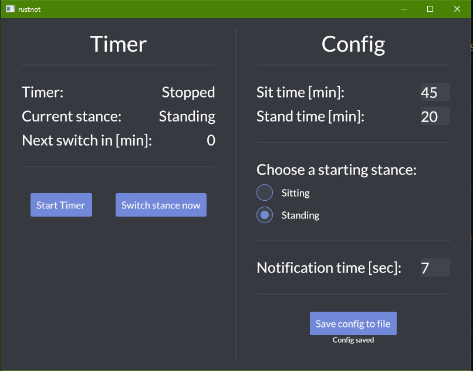

# rustnot

_Don't rust. Stand up._

This tool is just a simple programm running in the background and remindining you to
stand up and sit back down via desktop notifications.

Reason for this is I have a desk which can be used while standing or sitting and while
working long hours at my PC I tend to forget to change my stance once in a while to
relax my back.

## Settings

You can set:

- a duration in minutes for both the standing and sitting time.
- the stance in which you start, when you start the timer.
- the duration the notification is shown.

### Notification duration on windows

Because the of limitations of the libary used to send notifications on windows.
You can only choose between 7 and 25 seconds.
The UI will allow you to enter any number, but the actual duration will be the one
closer to the entered one.

## Config

Upon start the tool tries to read the latest safed config from a
`rustnot_config.toml` file, if it exists. Elsewise it will load the default config.

The default config is:

- 45 min sitting
- 15 min standing
- Sitting as starting stance
- 7 sec notification duration

## Acknowledgements

The coloring/styling is copied from the [Styling example of `iced`](https://github.com/iced-rs/iced/tree/master/examples/styling)

## License

Licensed under either of

- Apache License, Version 2.0 ([LICENSE-APACHE](LICENSE-APACHE) or
  http://www.apache.org/licenses/LICENSE-2.0)
- MIT license ([LICENSE-MIT](LICENSE-MIT) or http://opensource.org/licenses/MIT)

at your option.
